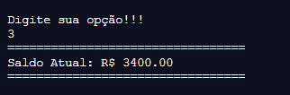

# Projeto de CC2632 
> Gerenciador Financeiro em C

[![Downloads Stats][npm-downloads]][npm-url]

Gerenciador Financeiro proposto como trabalho para a disciplina de Desenvolvimento de Algoritmos(CC2632) no 2° semestre do curso de ciências da computação da FEI.
Projeto totalmente desenvolvido na linguagem C, pelos alunos João Pedro Rosa Cezarino e Vítor Martins Oliveira.

```sh
Lembre-se de sempre criar o arquivo "saldo.txt" antes de rodar o código principal!!!
```


## Instalação

OS X & Linux:

```sh
sudo apt-get install g++
g++ -o main source/*.c main.c
./main
```

Windows:

```sh
Utilizar a IDE de sua preferência. Lembre-se de instalar um compilador da linguagem C( GCC, por exemplo)
```

## Exemplo de uso
Ao escolher a opção 1, o usuário tem a possibilidade de cadastrar um gasto ou uma receita no sistema. São requisitados o valor, a data e a categoria da despesa registrada.


Escolhendo a opção 2, pode-se obter o relátório de gastos do último mês(1) ou o relatório referente aos últimos 12 meses do ano escolhido pelo usuário. O programa requisita para isso, o mês e o ano desejado e logo após, um arquivo html contendo o gráfico é gerado.


Ao selecionar o número 3, o usuário tem acesso ao saldo referente à sua conta.Este é atualizado conforme o registro de novas despesas.



Selecionando o item 4, tem-se a possibilidade de remover apenas um registro do sistema(1) ou remover todos os dados registrados até então(2).


A opção 5 é responsável por imprimir um "extrato" de todas as movimentações registradas até então.


Por fim, ao escolher a opção 6, o usuário tem a possibilidade de encontrar um registro específico por meio da data e da categoria registradas no sistema.


## Desenvolvedores

João Pedro Rosa Cezarino – [@Rosa_jaoc](https://twitter.com/@Rosa_jaoc) – [@_akajhon](https://instagram.com/_akajhon) - jp_2602@hotmail.com

Vítor Martins Oliveira - [@Vihmartiinss](https://twitter.com/@Vihmartiinss)– [@vitinho.mrt](https://instagram.com/vitinho.mrt) - vihmar2002@hotmail.com

[https://github.com/akajhon/Projeto-CC2632](https://github.com/akajhon/)

Qualquer dúvida entre em contato!

## Contribuições

1. Faça o _fork_ do projeto (<https://github.com/akajhon/Projeto-CC2632/fork>)
2. Crie uma _branch_ para sua modificação (`git checkout -b feature/fooBar`)
3. Faça o _commit_ (`git commit -am 'Add some fooBar'`)
4. _Push_ (`git push origin feature/fooBar`)
5. Crie um novo _Pull Request_

[npm-image]: https://img.shields.io/npm/v/datadog-metrics.svg?style=flat-square
[npm-url]: https://npmjs.org/package/datadog-metrics
[npm-downloads]: https://img.shields.io/npm/dm/datadog-metrics.svg?style=flat-square
[wiki]: https://github.com/akajhon/Projeto-CC2632
